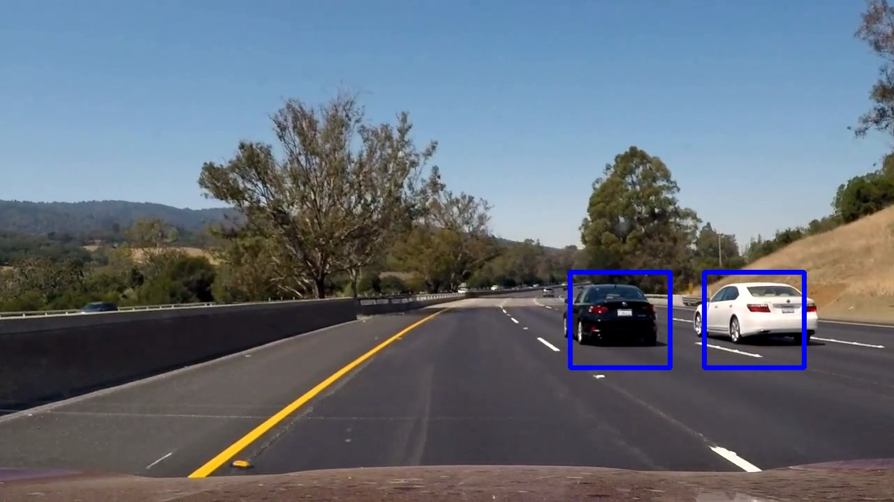

# Vehicle Detection

The goal is to write a software pipeline to detect vehicles in a video. 

### Approach

I extract hog () features from the training images and use this feature to train a linear SVM classifer.

The Linear SVM classifier is used inside a pipeline to detect vehicles in a video. Here is the final output. Here is the [detailed report](https://github.com/purnendu23/Vehicle-Detection/blob/master/final_report.md) and the [final code](https://github.com/purnendu23/Vehicle-Detection/blob/master/vehicle_detection.ipynb).

